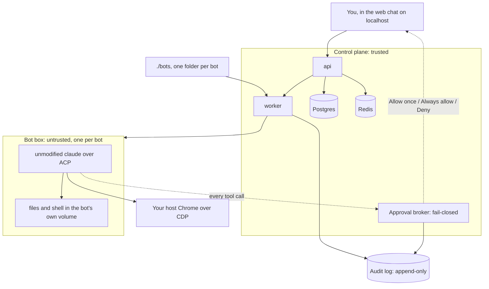

[](https://github.com/freema/drobek-bot/actions/workflows/ci.yml)
[](./LICENSE)

<!-- more badges when public -->

# drobek bot — open-source, self-hosted AI teammates. Your own Grok Bot, on your own machine.

_Named bots with their own isolated computer, skills and routines. Every action outside the box asks you first. Runs on your own API key, or on your existing Claude subscription — you sign in to the unmodified Claude Code inside the box yourself._

**Status: pre-alpha.** In place and measured: the `docker compose` stack with a health endpoint ([docker-compose.yml](./docker-compose.yml)), the data model with additive-only migrations and an append-only audit table ([packages/db](./packages/db)), and the thin bot box that drives the unmodified `claude` CLI over ACP — events, permission requests, session resume, your host Chrome over CDP and a hard cost cap, each with a measurement next to it ([box/README.md](./box/README.md)). Being built: bots as folders, the approval broker, the scheduler and the chat. Nothing on this page marked _planned_ or _coming_ exists yet.

- **1 bot = 1 isolated container** — files, shell and browser access per bot, nothing shared between bots.
- **Enforced approvals, not prompts** — Allow once / Always allow / Deny on every action that leaves the box, decided by a fail-closed broker.
- **Secrets never enter the transcript** — credentials are injected per run and redacted from every event; the model never sees them.
- **Hard cost cap** — per bot and per run; when it is hit the run stops and the box is killed.
- **Full audit** — what every bot did, when, and who approved it, in an append-only log.
- **Bring your own model** — API key first (Anthropic today; OpenAI-compatible and OpenRouter through the planned runtimes), or your own Claude subscription signed in inside the box.

Of these, the box, its permission gate, the cap per run and both model paths are proven in the spike ([findings](./box/README.md#findings)); the rest is being built in the order the [roadmap](#roadmap) gives.

## Get started

What works today: the stack comes up, the page shows the api's version and health, and the api reports the same as JSON. No bot runs yet.

Requirements: Docker with Compose. Node 22, pnpm 10 and [Task](https://taskfile.dev) are only needed for development.

```sh
git clone https://github.com/freema/drobek-bot.git
cd drobek-bot
cp .env.example .env
docker compose up -d --build --wait
```

The first build takes a few minutes. Then open <http://localhost:3050>, or ask the api directly:

```sh
curl localhost:3050/api/health
```

```json
{
  "status": "ok",
  "service": "api",
  "version": "0.0.0",
  "commit": "dev",
  "checks": { "postgres": "ok", "redis": "ok", "worker": "ok" }
}
```

`status` is `ok` only when every check is, otherwise the endpoint answers 503. `commit` is the `GIT_SHA` the image was built with (`dev` unless you set it; `task dev` fills in the real one).

Prebuilt images and a two-file compose are coming with the first public release. Would rather let an agent do it? Paste [SETUP_PROMPT.md](./SETUP_PROMPT.md) into Claude Code, Codex or Cursor.

## Create your first bot

(coming — the guide is being built)

1. You tell the guide what the bot should do. It asks at most two questions.
2. It writes the bot's folder under `./bots` and runs the bot once, immediately, so you see what it does.
3. The routine it set up stays paused until you have looked at that first run and switched it on.

## How it works



A bot is a folder in `./bots`: its definition, skills and routines. The worker starts one container per bot from the thin box image and mounts the folder in; the bot's home volume keeps its memory, sessions and anything you installed. Inside the box runs the unmodified `claude` CLI, driven over ACP. Every tool call is gated: the broker asks you in the chat, records the decision, and the run continues or the action fails. Everything a bot did and every decision you took lands in the append-only audit log.

Today the compose file already mounts `./bots` and the Docker socket into the worker, the box image exists and the ACP driving is proven; the worker does not start boxes yet and the broker, scheduler and chat are being built.

## Runtimes

| Runtime                         | How                                        | State                                                                                                                                   |
| ------------------------------- | ------------------------------------------ | --------------------------------------------------------------------------------------------------------------------------------------- |
| Claude Code                     | ACP, through the `claude-code-acp` adapter | Proven in the spike: events, permission requests, session resume, host Chrome over CDP, cost cap ([findings](./box/README.md#findings)) |
| Codex CLI, Gemini CLI, OpenCode | ACP shims                                  | Planned                                                                                                                                 |
| A model-agnostic second runtime | Not decided                                | Later                                                                                                                                   |

## Security model

Plain and boundary-first. Where a point is not built yet it says so.

- **The app is trusted, the boxes are not.** The api and the worker are the trusted part. The worker mounts `/var/run/docker.sock` and starts boxes directly, the way Coolify or Portainer do. That makes the boundary app versus boxes, never app versus host: whoever controls the worker controls the host, so the app belongs to the host's trust domain and a box never does.
- **One container and one home volume per bot.** Nothing is shared between bots. The image and the box are proven ([box/README.md](./box/README.md)); the per-bot orchestration is planned.
- **Secrets are injected per run and redacted.** A secret enters the box as an environment variable for that run only, is redacted from every event and log line, and is never stored in the bot's transcript. The redaction exists in the spike (`redactionsHit` in every run summary) and the store's encryption, redactor and box allowlist are in place ([docs/secrets.md](./docs/secrets.md)); the injection into a box is planned.
- **The approval broker is fail-closed.** Unavailable means deny. A finding from the spike: the gate for _every_ tool call is a `PreToolUse` hook inside the box, because ACP permission requests alone skip read-only actions (read-only shell commands and reads inside the working directory never reach them). The hook is proven; the broker is planned.
- **Nothing is auto-installed in a box.** The image holds Node, the unmodified `claude`, git, `gh`, `glab` and curl. Need Python or a browser in a bot? Open its terminal and install it; it stays in the bot's volume. The volume persistence is proven; the terminal in the UI is planned.
- **The browser is your own Chrome over CDP.** On a local install the bot drives the host's Chrome through the Playwright MCP server; there is no bundled Chromium. Proven.
- **The `claude` binary is never modified** and the app never stores or proxies Claude.ai credentials. You sign in inside the box yourself and the credentials stay in the bot's volume; with an API key, the key is the only thing the box receives. Proven.

What it does not do yet: no VM-level isolation (containers over the Docker socket; Firecracker or gVisor are on the roadmap), no network egress policy for boxes (they use whatever network the host has), and no login on the web UI (it is a single-user install on localhost). Found something? Open a security advisory rather than a public issue once the repository is public.

## Comparison (as of 2026-08-29)

Facts as documented by each product on this date; "not documented" means we found no statement to cite. Corrections by pull request are welcome.

| Product                                                                | Runs where                                                                                     | Isolation per bot                                                                                                | Approvals                                                                                                                     | Secrets                                                                                                                                     | Audit                                                                | Model                                                                                                                                              | License / price                                                                                            |
| ---------------------------------------------------------------------- | ---------------------------------------------------------------------------------------------- | ---------------------------------------------------------------------------------------------------------------- | ----------------------------------------------------------------------------------------------------------------------------- | ------------------------------------------------------------------------------------------------------------------------------------------- | -------------------------------------------------------------------- | -------------------------------------------------------------------------------------------------------------------------------------------------- | ---------------------------------------------------------------------------------------------------------- |
| **drobek bot**                                                         | Self-hosted `docker compose` on your machine or server                                         | 1 bot = 1 container + volume (image and box proven; per-bot orchestration planned)                               | Allow once / Always allow / Deny through a fail-closed broker, plus rules (planned; the permission gate in the box is proven) | Injected per run, never in the transcript (planned)                                                                                         | Full append-only audit (data model in place; the log itself planned) | Bring your own: unmodified Claude Code via ACP with your API key or your own subscription sign-in (proven); other runtimes via ACP shims (planned) | AGPL-3.0, free; you pay your model provider                                                                |
| Grok Bot (xAI + Cursor, beta since 2026-08-11)                         | xAI/Cursor cloud; desktop app for macOS and Windows, iOS app                                   | One cloud Linux VM per account, shared by all bots; the docs say not to use separate bots as a security boundary | Per action: Allow once / Deny / Always allow; "Require Approval" rules override "Always allow"                                | Masked secure channel outside the transcript; hands control to you for 2FA and payments; credentials are documented to survive bot deletion | not documented                                                       | Unnamed; not bring-your-own                                                                                                                        | Closed source; bundled with SuperGrok Plus/Heavy and Cursor Pro+/Ultra (Ultra $200/month) and Cursor Teams |
| Claude Cowork (Anthropic; announced 2026-01-12, GA 2026-04-09)         | Anthropic cloud                                                                                | not documented (one assistant with connectors)                                                                   | not documented                                                                                                                | not documented                                                                                                                              | not documented                                                       | Claude models only                                                                                                                                 | Closed source; included in Claude plans                                                                    |
| [Rakazo](https://github.com/elie222/rakazo) (first release 2026-08-13) | Self-host or cloud                                                                             | Sandbox per bot through a provider abstraction (Docker, E2B, Daytona)                                            | Action approval rules and reviewed external effects; optional LLM auto-review                                                 | Kept out of the sandbox: the agent runs in the API/worker process                                                                           | not documented                                                       | Model-agnostic runtime (Pi)                                                                                                                        | Apache-2.0, free                                                                                           |
| [OpenMausBot](https://github.com/milind-soni/OpenMausBot)              | Local-first Electron app over your local `claude`, `codex` and `grok` CLIs; optional cloud box | not documented (shared host or one box)                                                                          | Permission broker with Allow/Deny cards                                                                                       | not documented                                                                                                                              | not documented                                                       | Whatever your CLIs use                                                                                                                             | Apache-2.0, free                                                                                           |

Cost caps are not a column because only drobek bot documents one: a hard cap per run, proven in the box ([cap proof](./box/README.md#findings)); per bot, planned.

## Roadmap

No dates. Each milestone is usable on its own.

- **M0 — walking skeleton.** Bot = folder; Claude via ACP in a thin box; SSE chat on localhost; enforced approvals; a scheduler instead of a terminal loop; secrets; cost cap.
- **M1 — bots you can leave running.** Signal and Telegram channels with approvals from your phone; an email briefing skill; context management; restart and reset a bot; persistent workspace and browser profile; cost graphs and alerts; a skills library; audit export; runtime shims.
- **M2 — team and plugins.** Group chats and delegation; MCP plugins with OAuth; event triggers; approval rules with optional LLM review; deploy bot outputs; multi-user workspaces.
- **M3.** Firecracker/gVisor isolation; a hosted variant; a model-agnostic runtime; SSO/SCIM; teach a task from a recording; a desktop app.

## Contributing

The rules for working in this repository are in [AGENTS.md](./AGENTS.md); a `CONTRIBUTING.md` is coming. In short: Conventional Commits, small diffs, DCO sign-off (`git commit -s`), English everywhere, every PR says how it was verified.

Community: GitHub Discussions, once the repository is public.

## Development

`task check` runs the gate (typecheck, lint, tests), `task dev` builds and starts the stack with the real commit in `GIT_SHA`, `pnpm test:integration` runs the Testcontainers suites. `task stop`, `task reset` and `task logs` do what they say. Details stay in `docs/` and in each package.

<details>
<summary>Self-hosting on a server</summary>

The same compose file runs on a server. Put the web port behind your own TLS proxy and, since there is no login yet, behind your own authentication. The worker needs the host's Docker socket to start boxes; treat the machine as part of the app's trust domain (see [Security model](#security-model)).

</details>

<details>
<summary>Configuration</summary>

Everything is in [`.env.example`](./.env.example); `cp .env.example .env` gives working defaults.

| Key                                                 | What it does                                                                                           |
| --------------------------------------------------- | ------------------------------------------------------------------------------------------------------ |
| `WEB_PUBLISH`, `POSTGRES_PUBLISH`, `REDIS_PUBLISH`  | Host ports the stack publishes (3050, 5450, 6390). Change them if they collide with something local.   |
| `POSTGRES_USER`, `POSTGRES_PASSWORD`, `POSTGRES_DB` | Postgres credentials; compose builds `DATABASE_URL` for the services from them.                        |
| `GIT_SHA`                                           | The commit reported by `/api/health`; `task dev` sets the real one.                                    |
| `DROBEK_MASTER_KEY`                                 | The secret store's master key (`openssl rand -base64 32`); api and worker only. See `docs/secrets.md`. |
| `DATABASE_URL`                                      | Host-side only, for `pnpm db:migrate` against the running stack; the services never read it.           |

</details>

<details>
<summary>FAQ</summary>

**Does it modify Claude Code?** No. The box installs the published `@anthropic-ai/claude-code` package and drives it over ACP through the `claude-code-acp` adapter; the binary is pinned and the auto-updater is off ([box/README.md](./box/README.md)).

**Can I use my Claude subscription?** Yes. You sign in inside the box yourself with the CLI's own login; the credentials stay in the bot's volume and usage counts against your plan. The app never sees them.

**Why AGPL?** So that anyone who offers a modified drobek bot as a service has to publish their changes, which keeps the self-hosted version and any hosted variant the same product.

**Where do bots live?** In `./bots`, one folder per bot. The folder is the definition; the bot's working state (memory, sessions, anything you installed) lives in the bot's own volume.

</details>

## License

AGPL-3.0 — see [LICENSE](./LICENSE).
